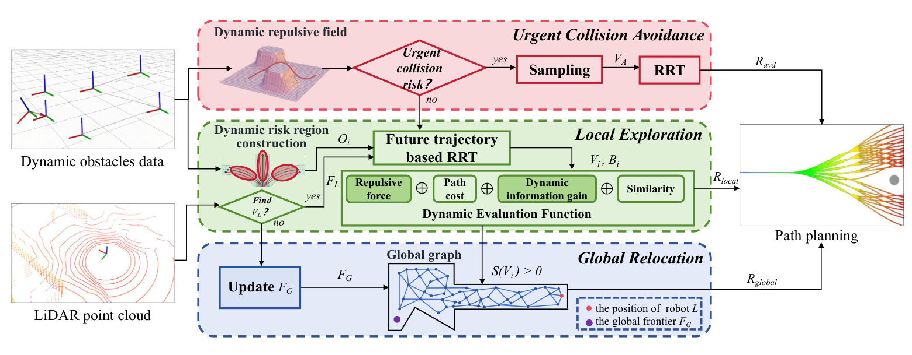

# Dynamic Three-Stage Viewpoint Planner for autonomous exploration in unknown environments with dynamic obstacles

## Overview

## Abstract

Autonomous exploration is a core capability for robots to construct maps of unknown environments and support downstream tasks. Existing exploration planners mainly target static environments, while real-world scenes often contain moving pedestrians, vehicles, and other dynamic objects that can interrupt exploration or cause collisions. D-TSVP addresses this problem with a three-stage planner that switches among urgent collision avoidance, local exploration, and global relocation according to the robot's current situation. When collision risk is detected, the planner constructs a dynamic repulsive field and quickly generates an avoidance route through RRT. When no urgent risk exists, it performs local exploration with future-trajectory-aware RRT, dynamic risk regions, and a dynamic evaluation function. If no local frontier is found, it updates global frontiers and searches the global graph for relocation. Experiments in dynamic simulation environments show that the planner achieves collision-free exploration while improving exploration performance and safety over baseline methods.
